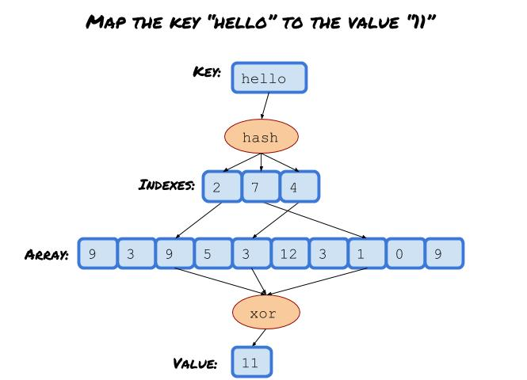

# XorSep

XorSep acts like a hash table, except it returns a random value when the key is not in the table.

## How does it work?

In a nutshell, the result of a key is queried by the xor of three values from an array via three indexes generated by a hash function.

XorSep solves a system of linear equations over GF(2) to construct the array conforming to the query results.
